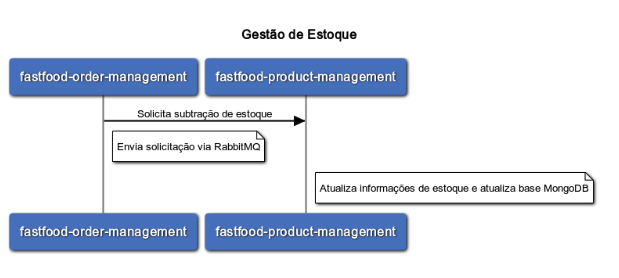

# fastfood-product-management
***
Serviço responsável pelo gerenciamento de produtos, preço e estoque do sistema fastfood


- Gestão de catálogo de produtos
- Gestão de preços de produtos
- Gestão de estoque de produtos
***
### [Api Produto](#Api_Produto)

***

#### **Cadastro de produto**

Exemplo Payload :
```javascript
POST /produto
{
  "nome": "Cheese Burger",
  "descricao": "pao, hamburguer, alface, queijo, molho especial",
  "categoria": "LANCHE"
}
```

<br>

### [Api Estoque](#Api_Estoque)

***

#### **Gestão de estoque**

Exemplo Payload :
```javascript
POST /estoque
{
  "idProduto": 1,
  "quantidadeEstoque": 70
}
```


Subtração de estoque :
```javascript
POST /estoque/produto/1?quantidade=5
```



<br>

### [Api Preço](#Api_Preço)

***

#### **Gestão de preço**

Exemplo Payload :
```javascript
POST /preco
{
  "idProduto": 1,
  "preco": 10.5
}
```

<br>

### [Tecnologias](#Tecnologias)
***
* Java
* Spring Boot
* Swagger
* MySQL
* Docker
* Kubernetes

<br>

### [Grupo 7](#grupo-7)
***
* Jackson Carlos Leite Ramalho
* Valqueline Nicácio da Silva
