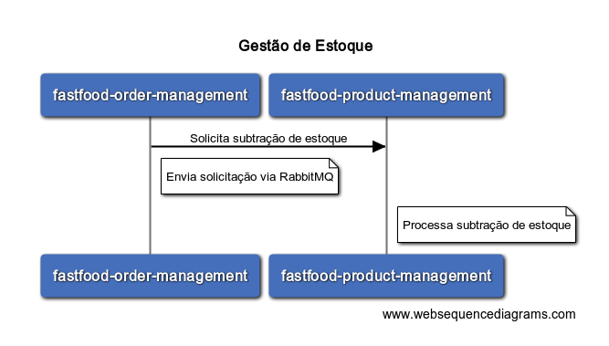

# fastfood-product-management
Serviço responsável pelo gerenciamento de produtos, preço e estoque do sistema fastfood


- Gestão de catálogo de produtos
- Gestão de preços de produtos
- Gestão de estoque de produtos
***
### [Api Produto](#Api Produto)

<br>
<br>

#### **Cadastro de produto**

Exemplo Payload :
```javascript
POST /produto
{
  "nome": "Cheese Burger",
  "descricao": "pao, hamburguer, alface, queijo, molho especial",
  "categoria": "LANCHE"
}
```
</br>

#### **Gestão de estoque**

Exemplo Payload :
```javascript
POST /estoque
{
  "idProduto": 1,
  "quantidadeEstoque": 70
}
```

<br>

#### **Gestão de estoque**

Exemplo Payload :
```javascript
POST /estoque
{
  "idProduto": 1,
  "quantidadeEstoque": 70
}
```

Subtração de estoque :
```javascript
POST /estoque/produto/1?quantidade=5
```



<br>

#### **Gestão de preço**

Exemplo Payload :
```javascript
POST /preco
{
  "idProduto": 1,
  "preco": 10.5
}
```

<br>